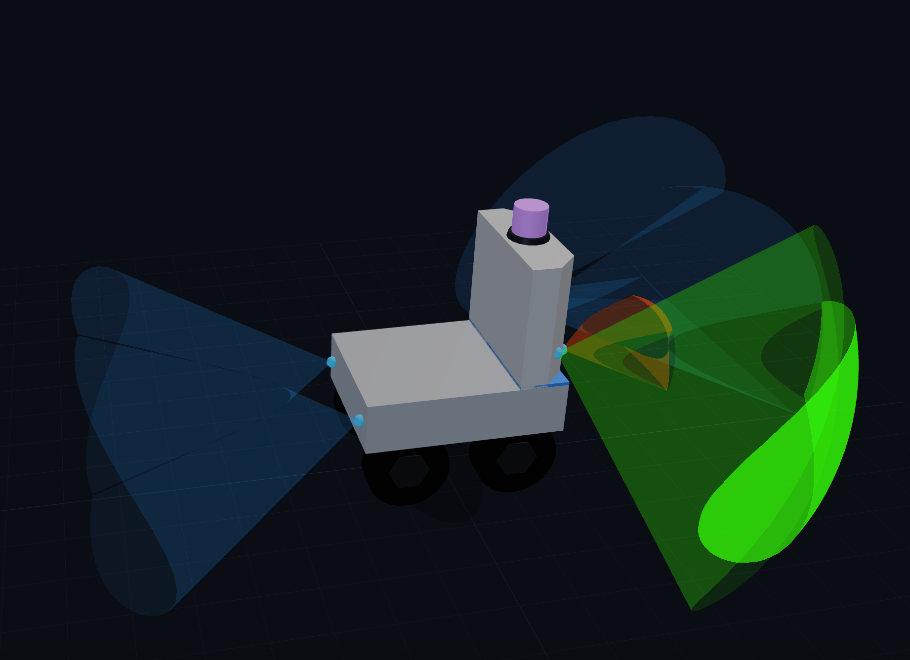

# beam-overlay

[](https://www.npmjs.com/package/beam-overlay)
[](./LICENSE)



A Three.js library for visualizing the **detection volumes of directional range sensors** in 3D.

Each sensor is rendered as an "elliptic cone + spherical cap" solid (its detection beam).
When multiple beams overlap, a GLSL fragment shader performs **per-fragment surface culling**
so that only the outer shell of the union remains — highlighting the danger zone where
obstacles are close.

It is **sensor-type agnostic**: ultrasonic, mmWave radar, IR range finders, ToF, etc.
`ULTRASONIC_PRESET` is just a built-in convenience preset for a common beam shape.

## Install

```bash
npm install beam-overlay
# three is a peerDependency, install it yourself
npm install three
```

## Usage

```ts
import * as THREE from 'three'
import { BeamOverlay, ULTRASONIC_PRESET, withPreset } from 'beam-overlay'

// Option 1: write full SensorDef objects
const overlay = new BeamOverlay([
  {
    key: 'front_left',
    position:       { x: -150, y: 500, z: -362 },  // mm, Y is up
    direction:      { x: 0, y: 0, z: -1 },
    beamAngleHDeg:  45,
    beamAngleVDeg:  20,
    minRangeMm:     250,
    maxRangeMm:     1000,
  },
  // ... any number of sensors
])

// Option 2: fill the beam shape from a preset, only write key/position/direction (recommended)
const sensors = [
  { key: 'front_left',  position: { x: -150, y: 500, z: -362 }, direction: { x: 0, y: 0, z: -1 } },
  { key: 'front_right', position: { x:  150, y: 500, z: -362 }, direction: { x: 0, y: 0, z: -1 } },
].map(s => withPreset(ULTRASONIC_PRESET, s))
const overlay2 = new BeamOverlay(sensors)

scene.add(overlay.group)  // add to the same scene as your robot model, coordinate systems must align

// Host animation loop
function animate() {
  requestAnimationFrame(animate)
  const dt = clock.getDelta()

  overlay.tick(dt)
  overlay.update({
    front_left:  820,   // mm, obstacle detected
    front_right: null,  // no obstacle
  })

  renderer.render(scene, camera)
}

// Release GPU resources on teardown
overlay.dispose()
```

> If your scene unit is not mm (e.g. 1 unit = 10mm), pass `new BeamOverlay(sensors, { mmPerUnit: 10 })`.

## API

### `new BeamOverlay(sensors: SensorDef[], options?: { mmPerUnit?: number })`

- `sensors`: array of sensor definitions (no fixed limit; the shader is sized to the actual
  count at construction time — the only ceiling is GPU uniform capacity, typically hundreds)
- `options.mmPerUnit`: scene scale factor, 1 scene unit = mmPerUnit mm (default 1)

### `overlay.group: THREE.Group`

The node to add to your host `scene`; contains all beam geometry.

### `overlay.tick(dt: number): void`

Call every frame to drive the pulsing animation. `dt` is in seconds.

### `overlay.update(readings: Readings): void`

Feed the latest range readings to update the rendering. `readings` keys map to
`SensorDef.key`; values are distances in mm, or `null` for "no obstacle".

### `overlay.getFrameData(): FrameData`

Returns the computed result of the current frame (for business logic to consume).

### `overlay.dispose(): void`

Releases all GPU resources.

### Presets

- `ULTRASONIC_PRESET: BeamPreset` — a typical ultrasonic beam shape (H 45° / V 20°, range 0.25–1.0m)
- `withPreset(preset, { key, position, direction, ...overrides }): SensorDef` — fill beam-shape
  fields from a preset; any field can be overridden.

## Coordinate system

- Unit: millimeters (mm)
- Right-handed, Y-up (matching the Three.js default)
- The caller is responsible for aligning `position` with the robot model's coordinate system

## Example (Demo)

`examples/yhs-demo` is a full example rendering a YHS robot plus 6 overlapping ultrasonic beams.

```bash
# Build the library first (the demo references the build output via file:../..)
npm install
npm run build

# Run the demo
cd examples/yhs-demo
npm install
npm run dev
```

## Development

```bash
npm install
npm test          # vitest unit tests
npm run build     # build dist + type declarations
```

## License

[MIT](./LICENSE) © chenzikun
